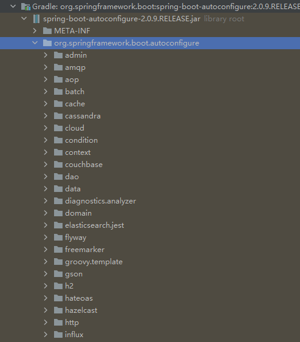

## 概要

### 要点

- 介绍各种配置方式的优先级。
- 介绍各种外部化配置方式。
- 介绍yaml的格式及原理。
- 介绍如何绑定并测试类型安全的属性配置。
- 介绍  `@ConfigurationProperties` 与 `@Value` 的区别。

### 优先级

Spring Boot 使用一种非常特殊的 `PropertySource`  顺序，其设计目的是允许非常符合情理的覆盖重写值。

一般按照以下顺序进行加载:

1.  默认属性，通过 `SpringApplication.setDefaultProperties` 指定；
2. `@Configuration` 类上注解的 `@PropertySource ` 配置;
3. 配置文件, `application.properties`， `application.yml` 文件等；
    1. jar **包内** 的  `Application properties`, 例如 `application.properties`， `application.yml`等；
    2. jar **包内** 通过 `profile` 指定的 属性， 例如  `application-{profile}.properties`;
    3. jar **包外** 的 `Application properties` 文件， `application.properties` 以及 `yaml` 的各种变体；
    4. jar **包外** 通过 `profile` 指定的 属性， 例如  `application-{profile}.properties`  以及 `yaml` 的各种变体。
4.  通过 `RandomValuePropertySource` 和配置  `random.*` 生成的随机属性值，支持 `int`, `long`， `string`, `uuid`;
5. 操作系统环境变量；
6. java 系统属性 ，可通过 `System.getProperties()` 获取；
7. 来自 `java:comp/env` 的 `JNDI`属性；
8. `ServletContext `  初始化参数；
9. `ServletConfig` 初始化参数；
10. 来自 `SPRING_APPLICATION_JSON` 指定的属性；
11. 命令行参数；
12. 测试中的  `@SpringBootTest` 注解中的 `properties` 属性值 。
13. 测试中的 `@TestPropertySource` 注解；
14. 当 Devtools 处于活动状态时，在 `$HOME/.config/spring-boot` 目录中的 Devtools 全局设置属性。

!!! important
    以上配置顺序并非 属性优先级，而是加载顺序，一般是 **后加载覆盖前加载**

对于除测试以外的常见配置优先级如下:

1. 命令行；
2. `SPRING_APPLICATION_JSON`;
3. jar 包外部配置文件
    1. 通过 `--spring.config.name`,以及 `--spring.config.location=` 指定的配置文件；
    1. jar包同级目录 `config` 目录下的直接子目录，例如 `/config/app/application.yml`
    1. jar 包同级目录下的 `config` 目录；
    1. 当前目录；
    1. 类路径下的 `config` 目录；
    1. 类路径的根目录；
4. `@PropertySource `  
5. `SpringApplication.setDefaultProperties`
6. 字段默认配置;

## 常见配置方式

在以上列举的多种配置方式中，本章节将开发过程中常见的几种配置方式挑出来做具体讲解；

### 指定配置文件

#### 更换配置文件名称

如果不喜欢将 `application` 作为配置文件名，可以通过指定一个 `spring.config.name ` 环境属性切换到另一个文件名。

例如，要将 `myproject.properties` 或者 `myproject.yaml` 作为配置文件，可以按照以下方式运行应用程序:

```bash
$ java -jar myproject.jar --spring.config.name=myproject
```


#### 可选位置

如果需要指定一些确切位置的配置文件作为默认外部配置文件，可用通过使用 `spring.config.location` 来指定。 该属性可以接受多个 location。

```bash
$ java -jar myproject.jar --spring.config.location=\
    optional:classpath:/default.properties,\
    optional:classpath:/override.properties
```

!!! caution
    `spring.config.name`, `spring.config.location`, `spring.config.additional-location` 的优先级往往比较高，因此他们经常被定义到 环境变量中，例如 操作系统环境变量，系统属性，命令行参数等。

默认情况下，当指定的配置数据位置不存在时，Spring Boot 会抛出一个`ConfigDataLocationNotFoundException` 并且你的应用程序不会启动。

当然如果有多个可选位置，而有些位置可能不存在时，可以结合`optional:` 使用。

!!! note
    如果想忽略所有 `ConfigDataLocationNotFoundExceptions` 并继续启动，可以使用 `spring.config.on-not-found=ignore`

#### 通配符位置

通配符位置可以通过一个位置接受多个文件。这一般在多配置属性来源时费用有用。例如k8s。

例如应用有 redis 配置和mysql 配置，而我们希望将他们分开配置，同时要求他们存在于一个 `application.properties` 文件中。这可能导致他们放在不同的位置。例如 `/config/redis/application.properties` 和 `/config/mysql/application.properties` . 在这种情况下，通配符位置 `config/*/`, 将会使两个文件都被处理。

!!! caution
    通配符位置只能包含一个 `*` 和以 `*/` 结尾的目录位置或 `*/<filename>`  的文件位置。带通配符的位置根据文件名的绝对路径按字母顺序排序。

!!! tip
    通配符位置只能用于外部文件配置。不能在类路径中使用。

#### 指定 `profile`

除了 `application` 文件，Spring Boot 还将尝试使用命名约定加载特定于配置文件的文件 `application-{profile}` 。例如，如果您的应用程序激活了一个名为prod并使用 YAML 文件的配置文件，那么 `application.yml` 和 `application-prod.yml` 均会被加载，profile 文件中的属性优先级高于默认。

如果激活了多个配置文件， 采用 **最后胜出** 策略。 例如激活 `spring.profiles.active = prod,live`,那么对应同一个名称的属性，将采用 `live` profile 的配置。

!!! note
    最后获胜策略 适用于 "location group" (多个配置文件目录以 `;` 隔开)，以 `,` 隔开的多个配置文件采用 按照目录优先级加载。

#### 导入额外数据

应用程序属性可以使用 `spring.config.import` 属性从其他位置导入额外的的补充配置数据。导入在被加载时被处理，并作为附加文档处理，插入到默认的文档之下。

```properties
spring.application.name=myapp
spring.config.import=optional:file:./dev.properties
```
上面的配置将触发 `dev.properties` 文件中的属性导入（如果存在这样的文件）。导入的值优先于本文档已配置的属性。在上面的示例中，dev.properties可以重新定义spring.application.name为不同的值。


### 系统环境变量

在 Windows 上，如果添加新的 OS 环境变量，则必须重新启动进程(Java 进程、 Intellij IDEA)才能读取新的 OS 环境变量。

!!! note
    任何其他 Windows 可执行、系统级别对环境变量的更改只有在进程重新启动时才会传播到进程。

在 Linux 或 Windows 上添加用户变量或系统变量:
```bashrc
msg=hello
```

有以下几种方式可以来读取：

1. 通过系统类读取
    ```java
    System.getenv("msg")
    ```
1. 通过 `Environment` 对象
    ```java
    @Autowired
    private Environment environment;

    environment.getProperty("msg")
    ```
1. 注入 spring 环境变量
    ```java
    @Value("${msg}")
    private String msg;
    ```
1. 在 `application.properties` 文件中通过环境变量；
    ```properties
    msg=${msg}
    ```

### JSON Application Properties

环境变量和系统属性通常有一些限制，这意味着某些属性名不能使用,例如某些授权，商业性质的限制等。为了帮助实现这一点，springboot 允许您将一个属性块编码为单个 JSON 结构。

```bash
SPRING_APPLICATION_JSON='{"my":{"name":"test"}}' java -jar myapp.jar
```
在上面的示例中，可以从 Spring `Environment` 中得到  `my.name = test`。

同样的 JSON 也可以作为系统属性提供:
```bash
$ java -Dspring.application.json='{"my":{"name":"test"}}' -jar myapp.jar
```

或者 通过 命令行参数来实现:

```bash
$ java -jar myapp.jar --spring.application.json='{"my":{"name":"test"}}'
```

当然使用 JNDI  变量也可以实现 `java:comp/env/spring.application.json`


## 系统属性

java 平台本身使用一个 `Properties` 对象来维护自己的配置。`System` 类维护一个描述当前工作环境配置的 `Properties` 对象。系统属性包括有关 当前用户、 Java 运行时的当前版本以及用于分隔文件路径名称的组件的字符的信息等。

常见重要的系统属性有:

|钥匙   	| 意义 |
| ---   | --- |
|file.separator	|	分隔文件路径组件的字符。这是/UNIX 上的 " \" 和 Windows 上的 " "。
|java.class.path	|	用于查找包含类文件的目录和 JAR 档案的路径。类路径的元素由path.separator属性中指定的平台特定字符分隔。
|java.home	|	Java 运行时环境 (JRE) 的安装目录
|java.vendor	|	JRE 供应商名称
|java.vendor.url	|	JRE 供应商 URL
|java.version	|	JRE 版本号
|line.separator	|	操作系统用于分隔文本文件中的行的序列
|os.arch	|	操作系统架构
|os.name	|	操作系统名称
|os.version	|	操作系统版本
|path.separator	|	路径分隔符用于java.class.path
|user.dir	|	用户工作目录
|user.home	|	用户主目录
|user.name	|	用户帐户名称

### 读取

`System` 类有两个用于读取系统属性的方法: `getProperty` 和 `getProperties` 。

`System` 类有两个不同版本的 `getProperty`。两者都检索参数列表中命名的属性的值。两个 `getProperty` 方法中比较简单的一个只有一个参数，一个属性键例如，要获得 path.separator 的值，使用以下语句:
```java
//  返回系统变量，如果没有返回null
System.getProperty("path.separator");
// 返回系统变量，如果没有则返回 "default" 默认值
System.getProperty("path", "default");
```

`System` 类提供的访问属性值的最后一个方法是 `getProperties` 方法，它返回一个 `Properties` 对象。此对象包含一组完整的系统属性定义。


### 写入更新

若要修改现有的系统属性集，请使用 `System.setProperties`.

!!! note
    `setProperties` 方法更改当前运行的应用程序的系统属性。这些变化并不是持久的。也就是说，更改应用程序中的系统属性不会影响将来对这个应用程序或任何其他应用程序的 Java 解释器调用。运行时系统在每次启动时重新初始化系统属性。如果对系统属性的更改是持久的，那么应用程序必须在退出前将值写入某个文件，并在启动时再次读入这些值。


## spring boot 自动配置原理

基于 Spring 的应用程序有很多配置。

- 当我们使用 Spring MVC 时，我们需要配置组件扫描、Dispatcher Servlet、视图解析器、Web jars（用于传递静态内容）等等。
- 当我们使用 Hibernate/JPA 时，我们需要配置一个数据源、一个实体管理器工厂、一个事务管理器等等。
- ...

!!! question
    - 如果 Hibernate jar 在类路径上，如何自动配置数据源？
    - 如果 Spring MVC jar 在类路径上，如何自动配置 Dispatcher Servlet？

因为有些东西是相同的，甚至于有的bean 可以使用 `复制-粘贴`来搞定。

框架b的已有的配置完全可以在a应用框架上很好的使用。基于此，spring boot 提供最基础的通用配置，而这些配置可以被很方便的被客户定制覆盖。而这通常被称作 "自动配置"


### 初步了解

当我们启动一个 spring boot web 程序，往往可以看到一下输出:
```bash
Mapping servlet: 'dispatcherServlet' to [/]

Mapped "{[/error]}" onto public org.springframework.http.ResponseEntity<java.util.Map<java.lang.String, java.lang.Object>> org.springframework.boot.autoconfigure.web.BasicErrorController.error(javax.servlet.http.HttpServletRequest)

Mapped URL path [/webjars/**] onto handler of type [class org.springframework.web.servlet.resource.ResourceHttpRequestHandler]

```
上面的日志语句是 `Spring Boot Auto Configuration` 很好的实例。

一旦我们在项目中添加了 `Spring Boot Starter Web` 作为依赖项，`Spring Boot Autoconfiguration` 就会发现 Spring MVC 位于类路径中。它自动配置 dispatcherServlet，一个默认的错误页面和 webjars。

如果添加 `Spring Boot Data JPA Starter`，您将看到 `Spring Boot Auto Configuration` 自动配置一个数据源和一个实体管理器。

### 如何实现
所有的自动配置逻辑都在 `spring-boot-autoconfigure.jar` 中实现。`Mvc`、 `data`、 `jms` 和其他框架的所有自动配置逻辑都在此。



`Spring-boot-autoconfigure.jar` 内的其他重要文件是 `/META-INF/spring.factories`。此文件列出了 `EnableAutoConfiguration` 键下应该启用的所有自动配置类。下面列出了一些重要的配置。

```properties
# Auto Configure
org.springframework.boot.autoconfigure.EnableAutoConfiguration=\
org.springframework.boot.autoconfigure.admin.SpringApplicationAdminJmxAutoConfiguration,\
org.springframework.boot.autoconfigure.aop.AopAutoConfiguration,\
org.springframework.boot.autoconfigure.amqp.RabbitAutoConfiguration,\
org.springframework.boot.autoconfigure.batch.BatchAutoConfiguration,\
org.springframework.boot.autoconfigure.cache.CacheAutoConfiguration,\
org.springframework.boot.autoconfigure.cassandra.CassandraAutoConfiguration,\
org.springframework.boot.autoconfigure.cloud.CloudAutoConfiguration,\
org.springframework.boot.autoconfigure.context.ConfigurationPropertiesAutoConfiguration,\
org.springframework.boot.autoconfigure.context.MessageSourceAutoConfiguration,\
org.springframework.boot.autoconfigure.context.PropertyPlaceholderAutoConfiguration,\
org.springframework.boot.autoconfigure.couchbase.CouchbaseAutoConfiguration,\
org.springframework.boot.autoconfigure.dao.PersistenceExceptionTranslationAutoConfiguration,\
org.springframework.boot.autoconfigure.data.cassandra.CassandraDataAutoConfiguration,\
org.springframework.boot.autoconfigure.data.cassandra.CassandraReactiveDataAutoConfiguration,\
org.springframework.boot.autoconfigure.data.cassandra.CassandraReactiveRepositoriesAutoConfiguration,\
org.springframework.boot.autoconfigure.data.cassandra.CassandraRepositoriesAutoConfiguration,\
...
```

### 例子

我们来看一下 ·DataSourceAutoConfiguration·。

通常，所有 `Auto Configuration` 类都查看类路径中的其他可用类。如果在类路径中有可用的特定类，则通过自动配置来启用该功能的配置。像 `@ConditionalOnClass`、`@conditionmissingbean` 这样的注释可以帮助提供这些特性！

`@conditionalonclass({DataSource.class,EmbeddedDatabaseType.class })` : 表示只有当这些类在类路径中可用时才启用此配置。

```java
@Configuration
@ConditionalOnClass({ DataSource.class, EmbeddedDatabaseType.class })
@EnableConfigurationProperties(DataSourceProperties.class)
@Import({ Registrar.class, DataSourcePoolMetadataProvidersConfiguration.class })
public class DataSourceAutoConfiguration {
}
```

`@conditionalonmissingbean`: 只有在没有其他 bean 配置相同名称的情况下，才配置此 bean。

```java
@Bean
@ConditionalOnMissingBean
public DataSourceInitializer dataSourceInitializer() {
	return new DataSourceInitializer();
}
```

以下例子只有在没有类型为 `DataSource.class` 或 `XADataSource.class` 的 bean 时才配置嵌入式数据库。

```java
@Conditional(EmbeddedDatabaseCondition.class)
@ConditionalOnMissingBean({ DataSource.class, XADataSource.class })
@Import(EmbeddedDataSourceConfiguration.class)
protected static class EmbeddedDatabaseConfiguration {
}
```