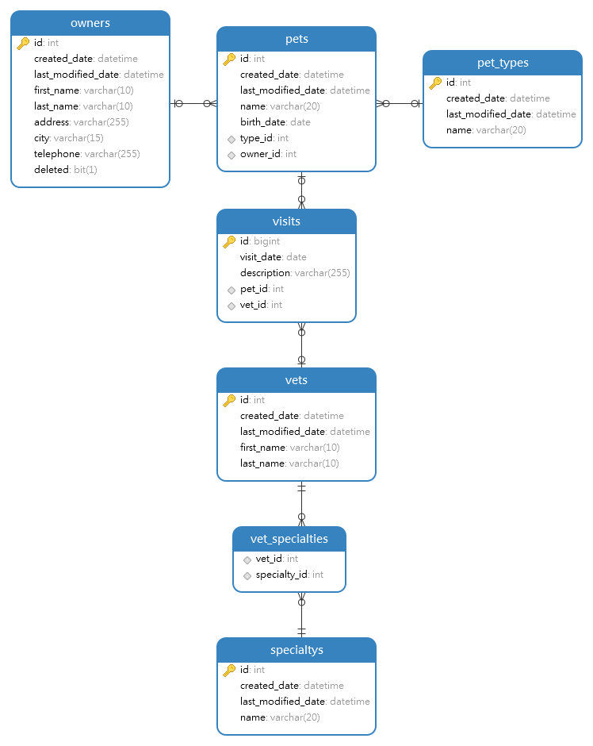

## 目标

1. 使用 `spring boot` + `gradle` 框架和工具创建一个简单的 curd 功能模块；
2. 采用 "宠物医院" 项目中的主人管理功能来示例；
3. 本章节还包含基本的 spring boot 实现 和数据源配置等；
<!-- 
宠物医院数据库模型图:

 -->

在本章节，采用 "主人" 也就是 "owner" 域 来开始一个简单的开发。

需求:

1. 可使用 "姓名","地址"字段进行模糊搜索主人列表；
1. 需要新增主人功能；
1. 需要修改主人信息功能；
1. 需要删除功能；  


## 原则

### 构建API

构建API 往往有三种设计风格： `code-first`, `api-first`, `design-first`;

在往后的开发中，后端开发会以 `api-first` 作为主要风格。尽量 `design-first`.


- **`code-first`**
    代码优先的方法往往是根据业务需求来编写 API。他通过编码，根据需求实现API，然后使用注释创建 API 描述，或者手动从头开始编写描述。代码优先的方法并不意味着不会有 API 设计,他会将设计过程分布在注释的各个地方。
- **`api-first`**
    API-first 方法意味着将 api 视为组织依赖的最重要的关键业务资产。 
    这种方法包括围绕一个用类似 `OpenAPI` 的 API 描述语言编写的契约来设计每个 API。从一个 API 契约开始，可以确保产生的 API 的一致性、可重用性和广泛的互操作性。   
- **`design-first`**
    设计优先，首先意味着在编写任何代码之前，用人类和计算机都能理解的迭代方式描述每个 API 设计。使用 API 设计优先的方法，每个团队使用相同的设计语言，甚至于他们的设计工具也趋于相同。

!!! tip
    `desgin-first` 往往被称为 "领域驱动设计"，但往往需要各职能部门统一的设计语言和工具，难度往往比较大。 :smile:

## code

### 添加依赖项

在 项目构建建脚本文件添加如下 依赖项,结果如下:

```groovy
dependencies {
    implementation 'org.springframework.boot:spring-boot-starter-data-jpa'
    implementation 'com.h2database:h2'
    implementation 'org.springframework.boot:spring-boot-starter-web'
    implementation 'org.springframework.boot:spring-boot-starter-validation'
    implementation "com.fasterxml.jackson.datatype:jackson-datatype-hibernate5"
    implementation "com.fasterxml.jackson.datatype:jackson-datatype-jsr310"
}
```

在以上依赖库中，我们使用了如下依赖:
-  `spring web （webmvc）` web项目开发 依赖；
- `H2` 内存数据库；
-  `spring data jpa` orm 框架；
-  数据验证框架；
- `jsr310` 的 `jackson`  时间标准序列化支持；

### 增加启动入口

1.  在 `src\main\java\cn\tendata\jstart` 新增程序入口类文件 `Application.java`：

    ```java
    package cn.tendata.jstart;

    import org.springframework.boot.SpringApplication;
    import org.springframework.boot.autoconfigure.SpringBootApplication;

    @SpringBootApplication
    public class Application {

        public static void main(String[] args) {
            SpringApplication.run(Application.class, args);
        }
    }

    ```

1. 在 `src\main\resources` 目录中新建 `application.yml` 项目外部配置文件, 并增加如下内容:

    ```yml
    server:
        port: 8080

    logging:
        file:
            path: logs/
        level:
            root: INFO
    ```   

    在以上配置中:
    1. 定义服务端口为 `8080`;
    1. 日志文件位于运行服务根目录的 `logs` 文件夹;
    1. 全局日志级别 为 `info`;
3. 验证；
    - 在终端 使用 ``

### API-first

