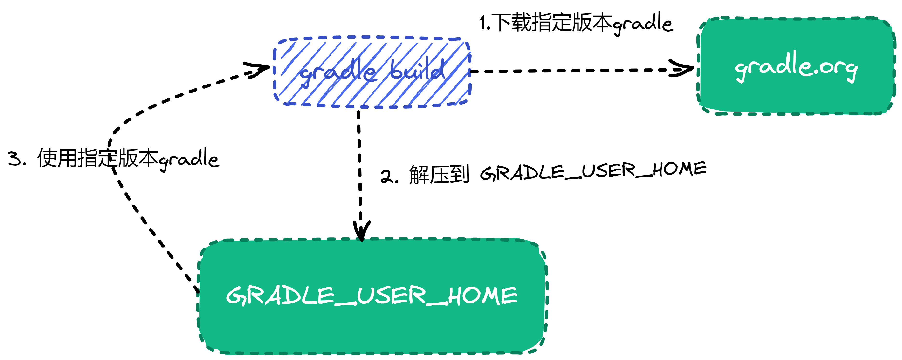

## 创建项目文件目录
 
 Gradle 内置一个 `init` 任务 ，它在一个空文件夹中初始化一个新的 Gradle 项目。 `Init`  任务
 使用(也是内置的) `wrapper` 任务 创建 Gradle wrapper 脚本  -  `gradlew` 文件。

1. 创建新项目文件夹 `tendata-jstart`；

    ```bash
    mkdir tendata-jstart
    ```

2. 进入 新项目文件夹；

    ```bash
    cd tendata-jstart
    ```

## 运行 gradle  初始化任务

1. 在新项目目录中，在终端中使用以下命令运行 init 任务: `gradle init`，根据提示选择相应的选项。 由于gradle init 初始化的源码目录结构和现有目录结构
不相匹配，选择 项目类型时，选择 `1` - `basic` 类型即可；构建脚本选择 `groovy`;其他选择默认即可。

输出如下：

```
$ gradle init
Starting a Gradle Daemon (subsequent builds will be faster)

Select type of project to generate:
  1: basic
  2: application
  3: library
  4: Gradle plugin
Enter selection (default: basic) [1..4] 1

Select build script DSL:
  1: Groovy
  2: Kotlin
Enter selection (default: Groovy) [1..2] 1

Generate build using new APIs and behavior (some features may change in the next minor release)? (default: no) [yes, no]

Project name (default: tendata-jstart):


> Task :init
Get more help with your project: Learn more about Gradle by exploring our samples at https://docs.gradle.org/7.4.2/samples

BUILD SUCCESSFUL in 4m 26s
2 actionable tasks: 2 executed
```

`init` 任务输出如下项目结构

```bash

.
├── .gitattributes   
├── .gitignore                # (1)
├── .gradle
├── build.gradle              # (2)
├── gradle                    # (3)           
│  └── wrapper
│      ├── gradle-wrapper.jar
│      └── gradle-wrapper.properties
├── gradlew                  # (4)
├── gradlew.bat
└── settings.gradle          # (5)

3 directories, 8 files
```

1. git 提交忽略 配置文件；
1. 项目构建文件；
1. gradle wrapper 文件包；
1. gradle wrapper 脚本文件, `windows` 使用 `gradlew.bat` 文件 ；
1. gradle 定义生成名称和子项目的配置文件；


### `settings.gradle` 

`settings.gradle` 主要包含两个方面的作用:

  1. 设置顶层项目名称，使用 `rootProject.name`；
  1. 组织子项目模块， 使用 `include` 方法；

常见的属性配置有:
  ```groovy
  rootProject.name = 'demo'

  include('app1')
  include('app2')
  ```
  该段配置表示 一个demo名称的项目包含 `app1`, `app2` 两个功能模块：

  - `rootProject.name` - 为构建分配一个名称，这将覆盖以其所在目录命名构建的默认行为。建议设置一个固定的名称，因为如果项目是共享的，那么文件夹可能会发生变化——例如作为 Git 存储库的根目录
  - `include`: 定义一个子项目模块 例如 `app1` 包含在顶层项目中；

### build.gradle

`build.gradle` 作为项目的构建脚本，定义了项目的构建，运行环境，包依赖，以及打包规则等。相较以前的maven，ant 构建来说，依托于 灵活的 `groovy` 脚本语言和强大的插件功能，使得gradle 在项目构建方面更加灵活，但是也提高开发人员的学习门槛。

常见的配置如下：
  ```groovy
  apply plugin: 'java'              // (1)
  apply plugin: 'eclipse'
  apply plugin: 'application'

  mainClassName = 'hello.HelloWorld'    // (2)

  repositories {                        // (3) 
      mavenCentral() 
  }

  jar {                                 // (4)
      archiveBaseName = 'gs-gradle'
      archiveVersion =  '0.1.0'
  }

  sourceCompatibility = 1.8             //(5)
  targetCompatibility = 1.8

  dependencies {                        // (6)
      implementation "joda-time:joda-time:2.2"
      testImplementation "junit:junit:4.12"
  }
  ```

1. 使用 插件；
1. 项目入口类；
1. 依赖库仓库源；
1. 打包方式类型；
1. 依赖jdk 版本；
1. 依赖库声明；


### gradle wrapper 相关

在以gradle 作为构建项目的最佳实践中，建议以gradle wrapper 作为构建任何任务的做法。gradle wrapper 脚本会检测 `GRADLE_USER_HOME` 中 是否包含 项目预先制定的gradle 版本
，如果没有会下载指定版本的gradle 到 `GRADLE_USER_HOME` 中。因此开发人员可以快速启动项目，而不需要配置安装复杂的gradle 环境。 



- `gradle-wrapper.jar` - 用于运行 wrapper 功能的 api 功能代码 jar 包。
- `gradle-wrapper.properties`
  负责配置 Wrapper 运行时行为的属性文件，例如与此版本兼容的 Gradle 版本，下载地址等
- `gradlew`,`gradlew.bat`
用于使用 Wrapper 执行构建的 shell 脚本和 Windows 批处理脚本。


### .gitignore

`gitignore` 文件的目的是确保某些未被 Git 跟踪的文件 保持不被Git 跟踪,下次提交的时候不会出现在 git commit 的列表中。

要停止跟踪当前跟踪的文件，请使用 `git rm --cached xxx.txt`。

常见的 `.gitignore` 文件参考如下：
```git
HELP.md
.gradle
build/
!gradle/wrapper/gradle-wrapper.jar
!**/src/main/**/build/
!**/src/test/**/build/

### STS ###
.apt_generated
.classpath
.factorypath
.project
.settings
.springBeans
.sts4-cache
bin/
!**/src/main/**/bin/
!**/src/test/**/bin/

### IntelliJ IDEA ###
.idea
*.iws
*.iml
*.ipr
out/
!**/src/main/**/out/
!**/src/test/**/out/

### NetBeans ###
/nbproject/private/
/nbbuild/
/dist/
/nbdist/
/.nb-gradle/

### VS Code ###
.vscode/
```

## 配置

### 创建源码目录结构

在项目根目录创建以下目录,或者在 Linux 终端使用 命令 创建 `mkdir -p src/main/java  src/main/resources src/test/java src/test/resources`

  - `src/main/java`: java 源码目录；
  - `src/main/resources`: 项目静态资源配置文件目录；
  - `src/test/java`: 单元测试源码目录；
  - `src/test/resources`: 单元测试配置文件目录；

构建后的项目结构如下:

```bash
.
├── .gitattributes
├── .gitignore
├── .gradle
├── build.gradle
├── gradle
│   └── wrapper
│       ├── gradle-wrapper.jar
│       └── gradle-wrapper.properties
├── gradlew
├── gradlew.bat
├── settings.gradle
└── src
    ├── main
    │   ├── java                          # (1)
    │   └── resources                     # (2)
    └── test
        ├── java                          # (3)
        └── resources                     # (4)
```  

  1.  java 源码目录；
  1.  项目静态资源配置文件目录；
  1.  单元测试源码目录；
  1.  单元测试配置文件目录；

### 配置构建脚本

一般的一个基本的gradle 项目构建包含 插件，依赖配置，依赖配置仓库，打包，任务等组成。如果需要更加复杂的项目构建，可以参考 [gradle官方文档](https://docs.gradle.org/current/userguide/what_is_gradle.html).

一个最简单的项目构建脚本如下可以参考 [build.gradle 文件](#buildgradle) 章节

本章节，我们可以根据实际情况更改我们的配置:

1. 使用 `idea`， `java`, `spring-boot` 等 插件；
1. 将仓库源设置为 `mavenLocal()` -> `aliyun` -> `mavenCentern()`;
1. 添加 spring web 开发依赖包；

最终配置如下:

```groovy
plugins {
    id 'org.springframework.boot' version '2.6.7'
    id 'io.spring.dependency-management' version '1.0.11.RELEASE'
    id 'java'
}

apply plugin: 'idea'
apply plugin: 'eclipse'
apply plugin: 'java'
apply plugin: 'io.spring.dependency-management'

group = 'cn.tendata.jstart'
version = '0.0.1-SNAPSHOT'
sourceCompatibility = 1.8
targetCompatibility = 1.8

bootJar {
    launchScript()
}

repositories {
    mavenCentral()
}

dependencies {
}

tasks.named('test') {
    useJUnitPlatform()
}

```

运行 Spring Boot 应用程序除了 `java -jar` 命令外，boot plugin 还为 Unix 系统制作完全可执行的应用程序。完全可执行的 jar 可以像任何其他可执行二进制文件一样执行，也可以使用或注册init.dsystemd。这使得在常见的生产环境中安装和管理 Spring Boot 应用程序变得非常容易。

对于gradle 配置
```groovy
bootJar {
    launchScript()
}
```

### 验证

验证初始化环境从以下几个 方法来验证：

1.  验证 gradle wrapper  H环境是否安装正确:
=== "linux"

    ```bash
    ./gradlew  --version
    ```  
=== "windows"

    ```bash
    ./gradlew.bat  --version
    ```
  显示如下结果，表示安装成功:
  ```bash

    ------------------------------------------------------------
    Gradle 7.4.2
    ------------------------------------------------------------

    Build time:   2022-03-31 15:25:29 UTC
    Revision:     540473b8118064efcc264694cbcaa4b677f61041

    Kotlin:       1.5.31
    Groovy:       3.0.9
    Ant:          Apache Ant(TM) version 1.10.11 compiled on July 10 2021
    JVM:          1.8.0_282 (Eclipse OpenJ9 openj9-0.24.0)
    OS:           Windows 8.1 6.3 amd64

  ```       
2.   查看gradle  任务:

```bash
./gradlew tasks
```

显示如下结果:
```bash
 luwei@DESKTOP-TDFJPJJ            tendata-jstart  .\gradlew.bat tasks

> Task :tasks

------------------------------------------------------------
Tasks runnable from root project 'tendata-jstart'
------------------------------------------------------------

Application tasks
-----------------
bootRun - Runs this project as a Spring Boot application.

Build tasks
-----------
assemble - Assembles the outputs of this project.
bootBuildImage - Builds an OCI image of the application using the output of the bootJar task
bootJar - Assembles an executable jar archive containing the main classes and their dependencies.
bootJarMainClassName - Resolves the name of the application's main class for the bootJar task.
bootRunMainClassName - Resolves the name of the application's main class for the bootRun task.
build - Assembles and tests this project.
buildDependents - Assembles and tests this project and all projects that depend on it.
buildNeeded - Assembles and tests this project and all projects it depends on.
classes - Assembles main classes.
clean - Deletes the build directory.
jar - Assembles a jar archive containing the main classes.
testClasses - Assembles test classes.

Build Setup tasks
-----------------
init - Initializes a new Gradle build.
wrapper - Generates Gradle wrapper files.

Documentation tasks
-------------------
javadoc - Generates Javadoc API documentation for the main source code.

Help tasks
----------
buildEnvironment - Displays all buildscript dependencies declared in root project 'tendata-jstart'.
dependencies - Displays all dependencies declared in root project 'tendata-jstart'.
dependencyInsight - Displays the insight into a specific dependency in root project 'tendata-jstart'.
dependencyManagement - Displays the dependency management declared in root project 'tendata-jstart'.
help - Displays a help message.
javaToolchains - Displays the detected java toolchains.
outgoingVariants - Displays the outgoing variants of root project 'tendata-jstart'.
projects - Displays the sub-projects of root project 'tendata-jstart'.
properties - Displays the properties of root project 'tendata-jstart'.
tasks - Displays the tasks runnable from root project 'tendata-jstart'.

IDE tasks
---------
cleanEclipse - Cleans all Eclipse files.
cleanIdea - Cleans IDEA project files (IML, IPR)
eclipse - Generates all Eclipse files.
idea - Generates IDEA project files (IML, IPR, IWS)
openIdea - Opens the IDEA project

Verification tasks
------------------
check - Runs all checks.
test - Runs the test suite.

Rules
-----
Pattern: clean<TaskName>: Cleans the output files of a task.
Pattern: build<ConfigurationName>: Assembles the artifacts of a configuration.

To see all tasks and more detail, run gradlew tasks --all

To see more detail about a task, run gradlew help --task <task>

BUILD SUCCESSFUL in 2s
1 actionable task: 1 executed

```   